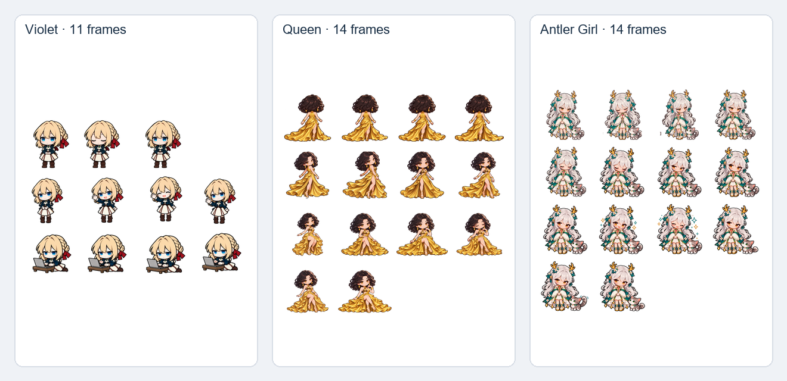

# Animated GitHub profile — character handoff

This package contains the three approved transparent character sprite sheets and the updated project brief. The next step is to build and preview the GitHub README layout and its SVG/GIF animations.

## Final action sets

| Character | Placement / relationship | Actions and frame counts | Total |
|---|---|---|---:|
| **Violet** | Independent AI assistant in the hero. She has no relationship or interaction with the Queen or Antler Girl. | Idle/blink (3), wave hello (4), typing on laptop (4) | 11 |
| **Queen** | Main royal character in the lower banner/footer, larger than Violet. | Walk in, back view (4), turn (3), sit (3), seated idle (4) | 14 |
| **Antler Girl** | Shy companion with her kitten beside the Queen. She may peek toward the Queen and brighten during her own animation. | Shy idle (3), blink (2), blush/peek (3), happy reaction (3), kitten tail flick (3) | 14 |

Violet's approved set is limited to those three actions. Do not add thinking, celebration, or looking at the Queen.

## Files

- `Violet/violet-spritesheet.png` — 4 columns × 3 rows, 512 × 512 px cells; one empty cell.
- `Queen/queen-spritesheet.png` — 4 × 4 atlas, 512 px cells; 14 frames and 2 empty cells.
- `Queen/throne-fixed.png` — stationary throne layer; composite behind the Queen, not into her frames.
- `AntlerGirl/antler-girl-spritesheet.png` — 4 × 4 atlas, 512 px cells; 14 frames and 2 empty cells.
- `sprite-sheets-overview.png` — labeled character-sheet overview.

Each action is arranged left to right, then top to bottom in the table order. Unused atlas cells are transparent.

## Design decisions

- Use Violet's existing chibi sheet as the master style reference: compact proportions, bold dark outlines, clean shapes, flat colors and light cel shading. Preserve her blonde braid, red bow, blue eyes, navy jacket, cream skirt and brown boots.
- The user approved the Queen + Antler Girl pair image as the current design reference. The Queen wears the gold Sandsylph Scion-style gown. Keep her throne fixed as a separate layer.
- The approved pair image shows the Antler Girl without glasses, and these frames follow that approved design. An earlier planning document mentions yellow-tinted glasses; ask the user before reintroducing them. Preserve her silver hair, golden antlers, teal flowers, white/teal/gold outfit, pink heart gem and grey kitten.
- Violet is independent and belongs in the hero section. The Queen and Antler Girl belong in the later banner/footer scene.

## GitHub implementation notes

- GitHub README content cannot run JavaScript. Use self-contained SVG with CSS/SMIL for animated scenes, or GIFs for dependable animated previews.
- Embed sprite PNGs once as base64 within SVGs; use local/repository assets and no external runtime dependencies.
- Keep Violet's animation timeline independent from the Queen and Antler Girl scene.
- The Queen arrival should take about 8–10 seconds and then hold the seated pose. Keep the throne stationary.
- Add cache-busting query parameters to deployed README image links when assets change.

## Remaining work

Build the GitHub README layout and SVG/GIF animations from these sheets, integrate each character in the intended section, and preview the complete page. Do not make Violet interact with the Queen or Antler Girl.

