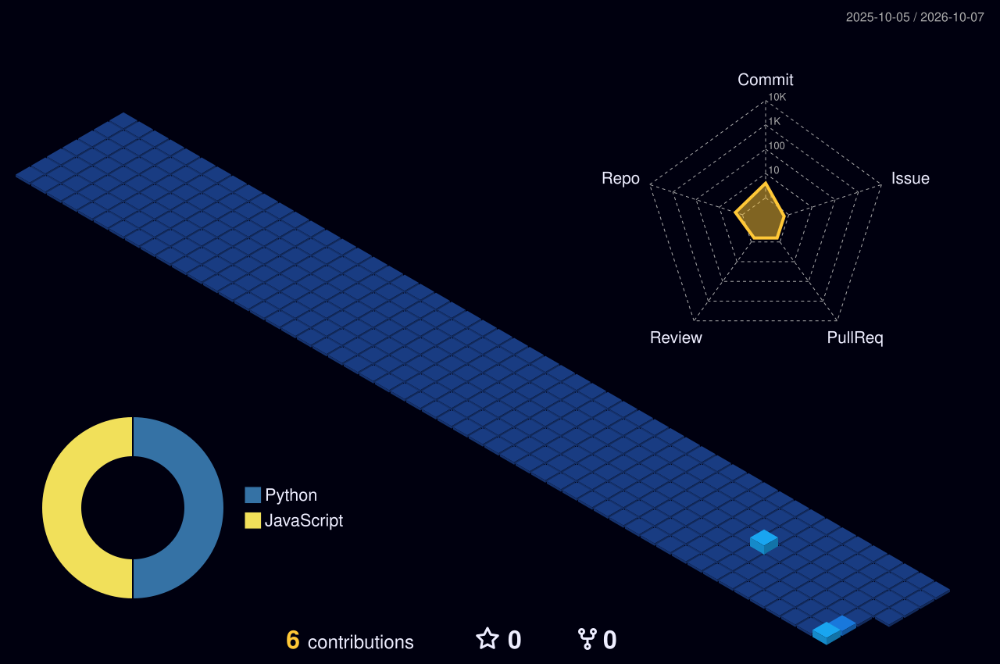

  <!-- 1. HERO BANNER: Violet Waving + Viewfinder + Cycling Roles (Charcoal & Sapphire) -->
  

    

  <!-- 2. ABOUT & LIFE: Violet Typing Browser + Hobbies Carousel + Daily Focus Rings -->
  

    

  <!-- 3. ROYAL SCENE: The Queen on Throne & Antler Girl with Kitten -->
  

    

  <!-- 4. TECH ORBIT: Planetary Tech Orbit & Grouped Chip Grid -->
  

    

  <!-- 5. ID BADGE & DASHBOARD: Swinging Lanyard + Academic KPIs + Radar -->
  

    

---

### 🚀 Featured Engineering &amp; Projects

| Project | Description | Tech Stack | Status / Link |
| :--- | :--- | :--- | :--- |
| [**💎 Infinity Stone Quiz**](https://github.com/Harsh-2959) | An interactive quiz game with cinematic visuals, engaging UI, and immersive soundscapes. | `React` `JavaScript` `Web` | [View Project →](https://github.com/Harsh-2959) |
| [**🛡️ MPLAD-SHIELD**](https://github.com/Harsh-2959) | AI-powered monitoring, compliance analytics, and transparency platform for MPLADS. | `AI` `Python` `Analytics` | [View Project →](https://github.com/Harsh-2959) |
| [**🦾 Handvora**](https://github.com/Harsh-2959) | Assistive sign language translation glove with synchronized Android app and text-to-speech. | `Android` `Arduino` `IoT` | [View Project →](https://github.com/Harsh-2959) |
| [**📡 Network Recon &amp; Security Tools**](https://github.com/Harsh-2959) | Security exploration, automated port scanning, and fundamental network reconnaissance scripts. | `Kali Linux` `Nmap` `Python` | [View Code →](https://github.com/Harsh-2959) |

---

  <!-- 6. 3D CONTRIBUTION SKYLINE (Generated daily via GitHub Actions) -->
  <h3>🏙️ Contribution Skyline (Night View)</h3>
  

    

  <!-- 7. CONNECT FOOTER: Character + Neon Sign + Social Links -->
  

    

  <!-- Direct Clickable Profile Badges -->
  
  &nbsp;&nbsp;
  

    

  Tailored Charcoal &amp; Moonlight Sapphire Edition · Pure SVG + CSS/SMIL animations · Built for <b>Harsh Nilesh Patil</b>

